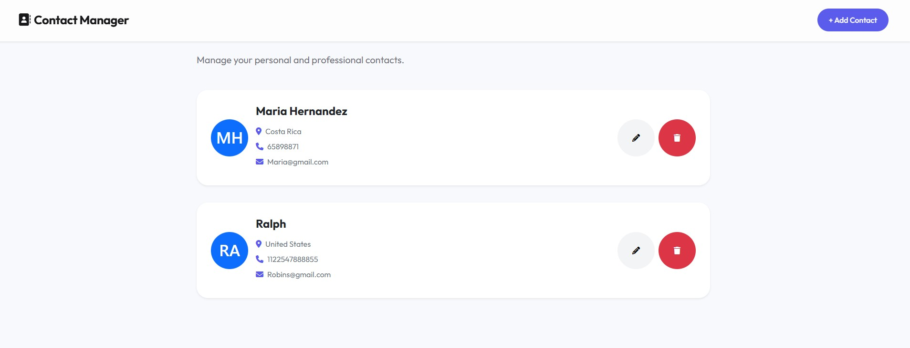

# 📇 Contact Manager

A modern contact management application built with **React**, **Vite**, and **JavaScript**.

The application allows users to create, edit, view, and delete contacts through a clean and responsive interface while demonstrating CRUD operations and REST API integration.

---

## 📸 Preview



---

## ✨ Features

- ➕ Create new contacts
- ✏️ Edit existing contacts
- 🗑️ Delete contacts
- 📋 View all contacts
- 🌐 REST API integration
- 📱 Responsive interface
- 🎨 Modern and clean UI

---

## 🛠️ Technologies

### Frontend

- React
- JavaScript (ES6+)
- Vite
- CSS3
- Bootstrap 5
- React Router

### API

- Fetch API
- REST API

---

## 💡 What I Learned

This project helped me strengthen my knowledge of:

- React components
- React Hooks
- State management
- CRUD operations
- REST API integration
- Form handling
- Component communication
- Responsive design
- Reusable UI components

---

## 📂 Project Structure

```text
src/
│
├── assets/
├── components/
├── hooks/
├── pages/
├── routes.jsx
├── store.js
└── main.jsx
```

---

## 🚀 Installation

Clone the repository

```bash
git clone https://github.com/meylin103/contact-manager.git
```

Install dependencies

```bash
npm install
```

Run the development server

```bash
npm run start
```

---

## 🚀 Future Improvements

- 🔍 Search contacts
- ⭐ Favorite contacts
- 📷 Upload profile pictures
- 🏷️ Contact categories
- 💾 Local storage support
- 🌙 Dark mode
- 🔐 User authentication

---

## 👩‍💻 Author

**Meilyn Fuentes**

- GitHub: https://github.com/meylin103